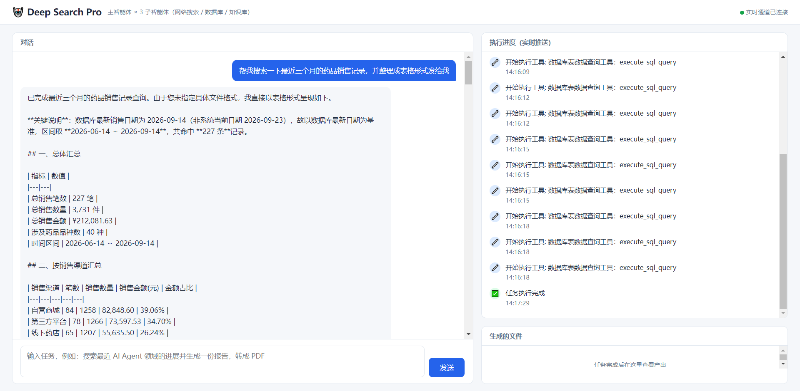

<p align="center">
  <h1 align="center">🤖 Deep Search Pro</h1>
  <p align="center"><b>多智能体协作-文档生成与转换系统 </b></p>
  <p align="center">
    <a href="https://github.com/penguinskeeper/deep-search-pro/actions/workflows/ci.yml"></a>
    
    
    
    
    
    
    <a href="./LICENSE"></a>
  </p>
</p>

<p align="center">
  
  <br>
  <sub>一次真实运行：提问近三个月药品销售记录 → 数据库子智能体连续执行 <code>execute_sql_query</code> → 右栏逐步推送每次工具调用，最终在对话区返回 Markdown 表格结果</sub>
</p>

---

## 🎯 项目介绍

该项目是基于 LangChain 生态构建一个的**多智能体协作系统**——一个"主智能体"像团队负责人一样调度三个"子智能体"（网络搜索、数据库查询、知识库检索）协同完成复杂任务，并把整个过程实时推送到浏览器。

**业务场景**：医药电商公司。数据库中是药品信息（`drugs`）与销售记录（`sales_records`），知识库中是医药行业资料。你可以问它：

> "帮我看下现在哪些药品库存偏低，再结合最近的行业政策，给我出一份补货建议报告。"

Agent 会自己去查库、搜网络、翻知识库，最后产出 Markdown / PDF 报告。


> 这个项目已经走完了一轮完整的产品化改造（持久化 / 反思机制 / 前端 / 测试 / CI / 容器化 / 安全加固）。
> 各环节的**设计取舍与踩过的坑**记在 [`docs/DESIGN.md`](./docs/DESIGN.md) 里。

---

## ✨ 整体架构

| 能力 | 实现说明 |
|------|---------|
| **多智能体编排** | 主智能体自动分解任务，调度网络搜索 / NL2SQL / RAG 三类子智能体 |
| **会话持久化** | `AsyncSqliteSaver` 落盘 `data/checkpoints.db`，服务重启后同一 session 可续聊 |
| **实时进度推送** | WebSocket 推送工具调用链路，前端时间线实时可见每一步 |
| **反思 / 自我修正** | 搜索空结果三级降级重试、SQL 报错回喂错误与表清单（self-healing SQL）、RAG 短答案换角度引导 |
| **并发安全** | ContextVar 协程级会话隔离，多用户并发不串台 |
| **文件安全层** | 路径穿越防护覆盖 12 类边界场景 + 上传下载越权校验 |
| **接口防护** | CORS 白名单、API Key 鉴权、上传类型与大小限制 |
| **跨平台 PDF** | WeasyPrint 优先（Linux / 容器可用），Word COM 作为 Windows 兜底 |
| **一键部署** | Docker Compose 编排 app + MySQL，演示数据自动灌入 |
| **质量保障** | pytest 42 个用例 + GitHub Actions（测试矩阵 + 镜像构建） |

---

## 🏗️ 运行流程

```
用户请求 (POST /api/task)
    │
    ▼
api/server.py          ← FastAPI 路由、WebSocket、鉴权与上传校验
    │
    ▼
agent/main_agent.py    ← 核心：主智能体创建（惰性单例）、checkpointer、异步流式执行
    │
    ├──→ 子智能体 1: 网络搜索     (tools/tavily_tool.py)     ┐
    ├──→ 子智能体 2: 数据库查询   (tools/db_tools.py)        ├─ 各自带反思/重试
    ├──→ 子智能体 3: RAGFlow知识库 (tools/ragflow_tools.py)   ┘
    │
    └──→ 主智能体自己调: 生成Markdown → 转PDF（WeasyPrint / Word COM）
    │
    ▼ (每个步骤都通过 WebSocket 实时推送)
api/monitor.py         ← 埋点监控 + WebSocket 连接池 + 事件循环归属判断
    │
    ▼
前端 (static/index.html)：实时进度时间线 → 报告生成 → 一键下载
```

### 数据流说明

1. 用户通过 `POST /api/task` 发一个自然语言请求（浏览器演示页或 curl 均可）
2. 主智能体分析需求，决定调用哪些子智能体
3. 子智能体各司其职，去搜网络 / 查数据库 / 翻知识库；**结果为空或报错时会自我修正重试**
4. 主智能体拿到所有信息后，汇总成一份 Markdown 报告（可转 PDF）
5. 整个过程通过 WebSocket 实时推到前端，前端能看到每一步进度，完成后可直接下载文件
6. 会话状态写入 SQLite，同一个 `thread_id` 下次继续对话仍能带上历史

---

## 🚀 如何运行系统

运行方式分两条路：**Docker Compose 一键启动**和**本地运行**（改代码调试用）。下面按「准备 → 启动 → 自检」的顺序写清楚。

### 0. 运行前准备

| 需要的东西 | 是否必需 | 说明 |
|-----------|---------|------|
| Python 3.10+ | 本地运行必需 | Docker 方式不需要，镜像内置 |
| LLM API Key | **必需** | 任何 OpenAI 兼容服务：阿里云百炼 / DeepSeek / OpenAI |
| Tavily API Key | **必需** | [免费额度注册](https://tavily.com) |
| MySQL 8.0 | 可选 | 不配则数据库子智能体不可用 |
| RAGFlow 服务 | 可选 | 不配则知识库子智能体不可用 |
| Docker Desktop | 仅方式一需要 | 版本 20.10+（含 compose v2） |

> 📌 **降级配置**：可选服务没配，主智能体会自动跳过对应子智能体，只配 LLM + Tavily 也能跑通完整链路（搜索 → 汇总 → 生成报告）。

---

### 方式一：Docker Compose（推荐，一键起 app + MySQL）

**第一步：配置环境变量**

```bash
cp .env.example .env
```

编辑 `.env`，至少填这几个（其余可留空）：

```env
OPENAI_BASE_URL=https://dashscope.aliyuncs.com/compatible-mode/v1
OPENAI_API_KEY=sk-xxxxxxxxxxxxxxxx
LLM=qwen-max
TAVILY_API_KEY=tvly-xxxxxxxxxxxxxxxx

# compose 用的 MySQL 凭据。不填会落到 docker-compose.yml 里的演示默认值
# （库 pharma_demo / 用户 dsp / 密码 dsp123456）——默认值仅供本地跑通，
# 部署到任何可被访问的环境前请务必覆盖。
MYSQL_ROOT_PASSWORD=your-root-password
```

**第二步：启动**

```bash
docker compose up -d --build
```

**第三步：确认服务状态**

```bash
docker compose ps          # 两个服务都应是 running / healthy
docker compose logs -f app # 看应用日志，出现 Uvicorn running on http://0.0.0.0:8000 即成功
```

**访问入口**

| 地址 | 用途 |
|------|------|
| `http://localhost:8000/` | 演示页（聊天输入 + 实时进度 + 文件下载） |
| `http://localhost:8000/docs` | Swagger API 文档，可直接在页面调试 |
| `localhost:3307` | MySQL（宿主机端口，避开本机已有实例冲突） |

**说明**：MySQL 首次启动时会自动执行 `data/seed_demo.sql`（建表 + 演示数据），`app` 容器会等 MySQL 健康检查通过后才启动；容器内已装 `fonts-noto-cjk` 与 Pango，中文 PDF 不会出现方块；生成的文件持久化在宿主机 `./output`。

**常用命令**

```bash
docker compose logs -f app        # 跟踪应用日志
docker compose restart app        # 重启应用（改完 .env 用这个）
docker compose down               # 停止并删除容器（数据卷保留）
docker compose down -v            # 停止并清空数据库，下次启动重新灌种子数据
docker compose up -d --build app  # 代码改动后重新构建应用镜像
```

---

### 方式二：本地运行（开发调试推荐）

**第一步：创建虚拟环境并安装依赖**

```bash
# 建议用虚拟环境，避免污染全局
python -m venv .venv
# Windows
.venv\Scripts\activate
# macOS / Linux
source .venv/bin/activate

pip install -r requirements.txt
```

**第二步：配置环境变量**

```bash
cp .env.example .env
```

`.env` 最少填 3 个必填项，其余按需：

```env
# ---------- 必填 ----------
OPENAI_BASE_URL=https://dashscope.aliyuncs.com/compatible-mode/v1
OPENAI_API_KEY=sk-xxxxxxxxxxxxxxxx
LLM=qwen-max
TAVILY_API_KEY=tvly-xxxxxxxxxxxxxxxx

# ---------- 可选：MySQL ----------
MYSQL_HOST=localhost
MYSQL_PORT=3306
MYSQL_USER=root
MYSQL_PASSWORD=your-password
MYSQL_DATABASE=pharma_demo

# ---------- 可选：RAGFlow 知识库 ----------
RAGFLOW_API_URL=http://your-ragflow-server
RAGFLOW_API_KEY=your-ragflow-key

# ---------- 可选：接口安全 ----------
API_KEY=                     # 留空 = 开发模式不校验；填了则写接口需带 X-API-Key 头
API_ALLOWED_ORIGINS=http://localhost:8000   # CORS 白名单（逗号分隔）
```

**第三步：启动服务**

```bash
python api/server.py
```

启动日志中出现 `Uvicorn running on http://0.0.0.0:8000` 表示成功。该命令带 `--reload` 热重载，改代码自动重启，适合开发。

> **Windows 用户**：也可以直接双击 `start_all.bat` —— 它会依次拉起 MySQL、API 服务并打开浏览器；
> 停止用 `stop_all.bat`（MySQL 走 `mysqladmin shutdown` 优雅关闭，比关窗口可靠）。
> 解释器解析：脚本会**逐个候选实测能否 `import uvicorn`**，第一个通过的才采用——顺序为
> `DSP_PYTHON` 环境变量 → 项目内 `.venv` → `.dsp-python.txt`（一行路径，已被 gitignore）→ PATH 上的 `python` / `py`。
> 这样在装了多个 Python（比如 Anaconda）的机器上不会选错环境。依赖装在项目外时，把那台解释器的路径
> 写进项目根的 `.dsp-python.txt` 一行即可，无需改系统环境变量。四个候选都不可用时脚本会直接报错退出，
> 不会带着错误环境硬起、等第一次请求才失败。
> 若你的 MySQL 不在 `D:\MySQL`，先 `set MYSQL_HOME=<你的路径>`。

**停止服务**：双击 `stop_all.bat` 一键停掉 API 服务 + MySQL（MySQL 走 `mysqladmin shutdown` 优雅关闭）。**不要直接关闭服务窗口**——`start_mysql.bat` 是 `mysqld --console` 前台进程，关窗口可能来不及完成优雅关闭，且 `--console` 会覆盖 `my.ini` 的 `log-error`，错误日志不落盘。是否停干净只看端口：`netstat -ano | findstr ":3306 :8000"` 无输出即全停。静态页已带 `Cache-Control: no-store`（见 `api/server.py` 的 `NoCacheStaticFiles`），停止后按 F5 即如实反映状态；本次改动前访问过的旧页面需先按 `Ctrl + Shift + R` 硬刷新一次清缓存。

**第四步（可选）：灌入演示数据库**

```bash
# 先建库，再导入
mysql -u root -p -e "CREATE DATABASE IF NOT EXISTS pharma_demo DEFAULT CHARSET utf8mb4;"
mysql -u root -p pharma_demo < data/seed_demo.sql
```

导入后可通过数据库子智能体直接提问，例如"哪些药品库存低于 100？"

> 这里导入的是**精简演示库**（`pharma_demo`，10 种药品）。想要 40 种药品 / 240 条销售记录的完整数据，
> 用 [`db_setup/`](./db_setup/README.md) 那套脚本（库名 `pharma_mall`）——导入后记得把 `.env` 的
> `MYSQL_DATABASE` 同步改成 `pharma_mall`，否则 Agent 会连错库。**两条路线选一条即可，不要都导。**

**第五步（可选）：跑测试**

```bash
pip install -r requirements-dev.txt
pytest
```

---

### 启动自检：确认整条链路通了

按顺序做这三步，能快速判断系统是否正常：

| 步骤 | 操作 | 预期结果 |
|------|------|---------|
| 1️⃣ 接口存活 | 浏览器打开 `http://localhost:8000/docs` | 看到 Swagger 文档页面 |
| 2️⃣ 任务链路 | 打开 `http://localhost:8000/`，输入"搜索一下最近 AI Agent 领域的最新进展" | 右侧时间线滚动出现 🔧 工具调用 / 🤝 子智能体调度事件，最后输出报告 |
| 3️⃣ 文件产出 | 任务完成后点文件区的下载按钮 | 能下载到生成的 `.md` / `.pdf` 文件 |

也可以不用前端，直接 curl：

```bash
curl -X POST http://localhost:8000/api/task \
  -H "Content-Type: application/json" \
  -d '{"query": "搜索一下最近AI Agent领域的最新进展"}'
# 返回 {"status":"started","thread_id":"xxxx"}，用它连 WebSocket 看实时进度：
# ws://localhost:8000/ws/{thread_id}
```

> **会话续聊**：请求体里带上上次返回的 `thread_id`，Agent 会加载该会话的历史上下文继续对话（历史存在 `data/checkpoints.db`，重启不丢）。

---

### 常见问题排查

| 现象 | 原因与解决 |
|------|-----------|
| 启动报 `No module named uvicorn` | **选错了 Python 解释器**（机器上装了多个 Python 时最常见）。`start_api.bat` 会自动按 `DSP_PYTHON` → `.venv` → `.dsp-python.txt` → PATH 的顺序实测挑选并跳过没有依赖的解释器；若四个都不可用它会直接报错告诉你。手动启动时请用装好依赖的那个解释器：`<解释器路径>\python.exe -m uvicorn api.server:app` |
| 启动报 `Address already in use` | 8000 端口被占用：`python api/server.py` 换端口，或先关掉占用进程 |
| 日志提示"会话历史降级为内存保存" | 未装 `langgraph-checkpoint-sqlite`：`pip install -r requirements.txt` 后重启 |
| 子智能体没被调用 / 提示缺配置 | 对应服务的环境变量缺失。MySQL 未配 → 数据库子智能体跳过；RAGFlow 未配 → 知识库子智能体跳过。这是设计上的优雅降级 |
| 接口返回 401 | `.env` 里配了 `API_KEY`，请求需带请求头 `X-API-Key: <你的密钥>`；演示页会弹窗让你输入并记住 |
| 上传返回 415 / 413 | 只接受 md / docx / pdf / xlsx / csv，且单个文件不超过 20MB |
| PDF 里中文变方块 | Linux/容器缺中文字体：容器已内置 `fonts-noto-cjk`；本机部署需 `apt install fonts-noto-cjk` |
| PDF 转换报缺 Pango | WeasyPrint 的系统依赖未装；Windows 会自动降级到 Word COM，Linux 需 `apt install libpango-1.0-0 libpangoft2-1.0-0` |
| 任务一直没进度推送 | 确认 WebSocket 连的是 `/ws/{thread_id}` 且 `thread_id` 与提交任务时返回的一致 |

---

## 📁 项目文件速查

```
deep-search-pro/
│
├── agent/                          # 🤖 智能体层（核心）
│   ├── llm.py                      # 模型初始化，10 行
│   ├── prompts.py                  # YAML 提示词加载
│   ├── main_agent.py               # ★ 主智能体（惰性单例）+ checkpointer + 异步执行引擎
│   └── subagents/                  # 子智能体（每个就是一个字典）
│       ├── network_search_agent.py
│       ├── database_query_agent.py
│       └── knowledge_base_agent.py
│
├── api/                            # 🌐 Web 接口层
│   ├── server.py                   # FastAPI 入口（路由 / 鉴权 / 上传校验 / 静态页挂载）
│   ├── context.py                  # ContextVar 协程隔离（带详细注释）
│   └── monitor.py                  # 监控 + WebSocket 连接池
│
├── tools/                          # 🔧 工具函数（6 个 @tool）
│   ├── tavily_tool.py              # 网络搜索（空结果三级重试）
│   ├── db_tools.py                 # 数据库查询 3 件套（SQL 报错回喂）
│   ├── ragflow_tools.py            # RAGFlow 知识库检索（懒加载 + 降级）
│   ├── markdown_tools.py           # 生成 Markdown
│   ├── pdf_tools.py                # Markdown → PDF
│   └── upload_file_read_tool.py    # 读取上传文件
│
├── utils/                          # 🛠 工具层
│   ├── path_utils.py               # 路径安全解析（12 种场景）
│   ├── pdf_converter.py            # 统一 PDF 转换入口（WeasyPrint 优先，Word 兜底）
│   └── word_converter.py           # Word COM 引擎（Windows 本地兜底）
│
├── static/index.html               # 💬 前端演示页（原生 JS 单页，零构建）
├── prompt/prompts.yml              # 提示词配置（医药电商场景）
├── data/seed_demo.sql              # 演示数据库建表 + 数据
│
├── tests/                          # 🧪 测试（42 个用例）
│   ├── conftest.py                 # 注入测试假环境变量
│   ├── test_path_utils.py          # 路径边界场景参数化测试
│   ├── test_db_tools.py            # 数据库工具（mock 连接）
│   ├── test_reflection_tools.py    # 反思/重试机制
│   └── test_api_server.py          # FastAPI TestClient 冒烟
│
├── rawflow/                        # 📚 RAGFlow SDK 独立示例（学习用，不是主链路）
│                                   #    ⚠️ 主链路的实现是 tools/ragflow_tools.py
│
├── db_setup/                       # 🗄 本机手工部署 MySQL 的脚本（另一条数据库路线）
│   ├── 01_schema.sql / 02_seed.sql #    建库 pharma_mall：40 药品 / 240 条销售记录
│   ├── 03_readonly_user.sql        #    只读账号（最小权限，密码自行填入）
│   ├── my.ini.example              #    MySQL 配置模板
│   └── README.md                   #    两条数据库路线的区别，先看这里
│
├── docs/
│   ├── DESIGN.md                   # 📐 设计说明：架构取舍与踩坑记录
│   └── images/                     #    演示截图（demo-chat.png / demo-home.png）
│
├── ragflow_docs/                   # 📄 知识库演示语料（作者自行撰写，9 篇）
│
├── .github/workflows/ci.yml        # ⚙️ CI：测试矩阵 + 镜像构建
├── Dockerfile / docker-compose.yml # 🐳 容器化（app + MySQL）
├── start_all.bat / start_api.bat   # ▶️ Windows 一键启动 / 只启动 API
├── stop_all.bat                    # ⏹ Windows 一键停止（MySQL 走优雅关闭）
├── requirements.txt                # 运行依赖（版本锁定）
├── requirements-dev.txt            # 开发依赖（pytest / ruff）
├── pytest.ini                      # 测试配置
├── .env.example                    # 🔑 环境变量模板（复制为 .env 后填值）
├── .gitignore / .gitattributes     # 收录规则 / 换行符规范
├── LICENSE                         # MIT
├── SECURITY.md / CONTRIBUTING.md   # 漏洞上报 / 贡献指南
└── 操作手册.md / TESTING.md         # 中文操作手册与测试手册
```

---


## 🔧 技术栈

| 层级 | 技术 | 说明 |
|------|------|------|
| Agent 框架 | **deepagents** (LangChain 官方) | 多智能体编排，本项目核心依赖 |
| LLM 接入 | LangChain + OpenAI 兼容协议 | 一套代码适配多种模型 |
| 状态持久化 | LangGraph Checkpointer (SQLite) | 会话跨重启续聊 |
| Web 框架 | FastAPI + Uvicorn | 异步 HTTP + 原生 WebSocket |
| 前端 | 原生 HTML / CSS / JS | 零构建，FastAPI 直接托管 |
| 搜索引擎 | Tavily API | AI 专用搜索，提供免费额度 |
| 知识库 | RAGFlow | 开源的 RAG 引擎，可以本地部署 |
| 数据库 | MySQL | 关系型数据库，Agent 自动写 SQL |
| 文档生成 | markdown + WeasyPrint | MD 生成 + HTML→PDF（跨平台，Word COM 兜底） |
| 测试 / CI | pytest + ruff + GitHub Actions | 42 用例 + 测试矩阵 + 镜像构建 |
| 部署 | Docker / Docker Compose | app + MySQL 双服务编排 |

---


## 🗺️ 路线图

目前**尚未实现**的部分，以及未来的改进方向

| 计划 | 说明 | 难度 |
|---|---|---|
| JWT 登录 + 多用户 | 当前是单机 demo 用的静态 `X-API-Key`；要做多用户需登录签发 Bearer token | 中 |
| API 限流（slowapi） | Agent 被刷会产生真实 LLM 费用，公开部署前建议加上令牌桶限流 | 低 |
| `rawflow/` 与主链路合并 | `rawflow/` 是学习期的最小示例，功能与 `tools/ragflow_tools.py` 重叠 | 低 |
| 依赖结构梳理 | `requirements.txt` 目前是 `pip freeze` 全量导出，可拆分「直接依赖 + 锁定版本」 | 低 |


已知限制（RAGFlow 未接通、CI 中 Docker 构建的验证情况等）记在 [`docs/DESIGN.md`](./docs/DESIGN.md) 第 9 节。

---


## 📄 License

[MIT](./LICENSE) © 2026 penguinskeeper

> 本项目为技术演示。`ragflow_docs/` 下的 9 篇药品资料**由作者自行撰写**
> 医药行业常识，不引用、不转载任何第三方版权文档，仅供演示知识库检索链路，
> **不构成任何医疗建议**；作者非医药专业人士，请勿将其作为用药参考。详见
> [`ragflow_docs/README.md`](./ragflow_docs/README.md)。


---

